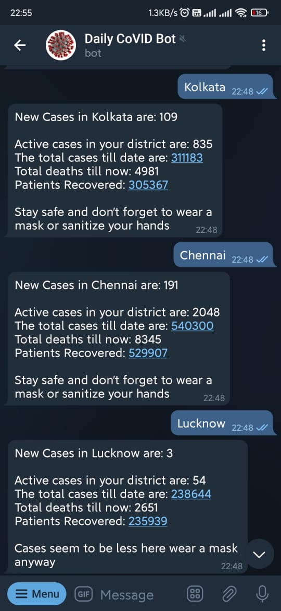
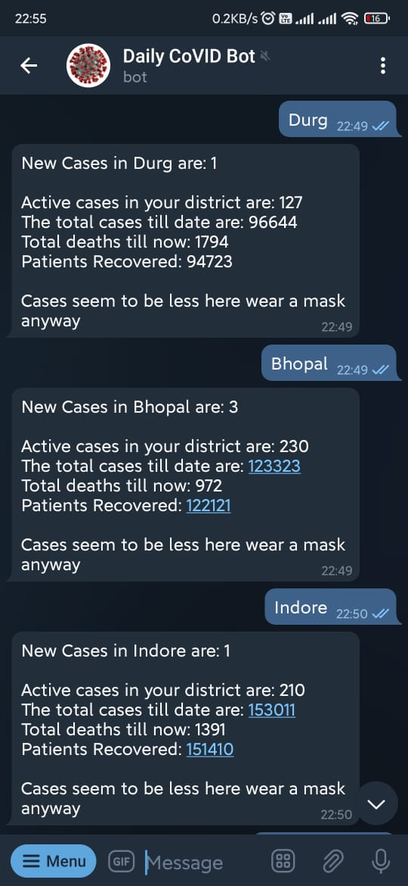

# LocalCorona_Bot
This Bot takes input of districts of Republic of India and returns the active, confirmed, recovered and deceased patients.  
Additional function of adding subscribers is there which if chosen sends data to user daily at a specefic time.
 

Source of data https://api.covid19india.org/state_district_wise.json

Dependencies:   
  requests  
  nested_lookup 
  urllib  
  schedule  
  bot framework(bot.py) by Saurabh Johar https://github.com/SouravJohar/gangsta 
 Tutorial can be found here https://www.youtube.com/watch?v=5nhdxpoicW4&ab_channel=SouravJohar
  
